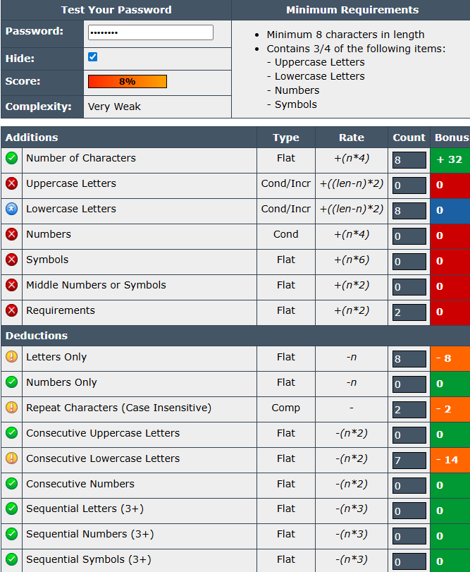
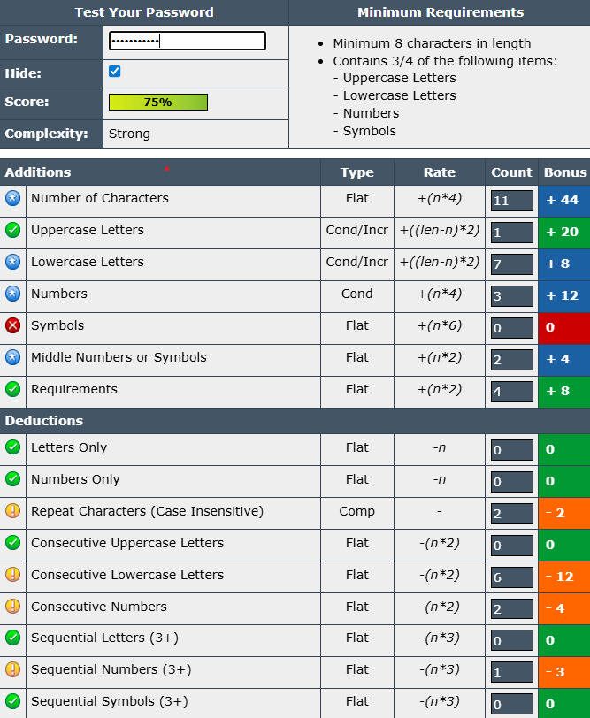
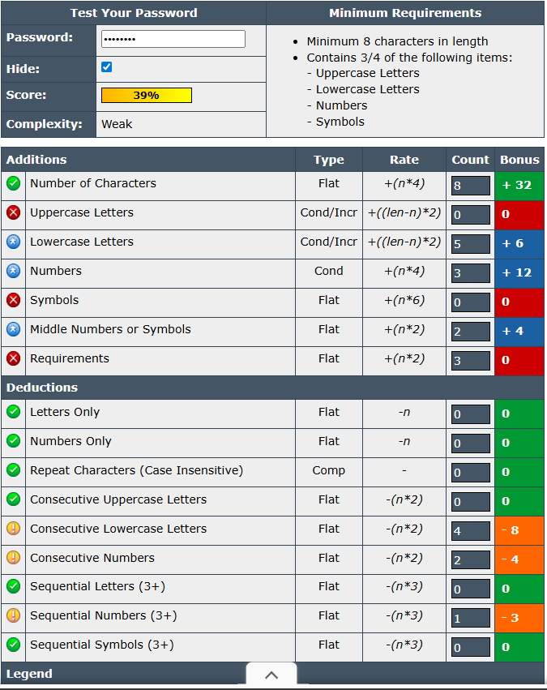
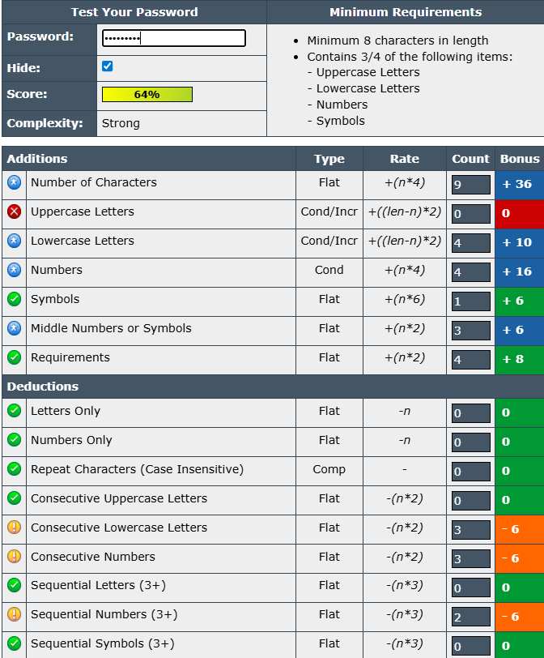
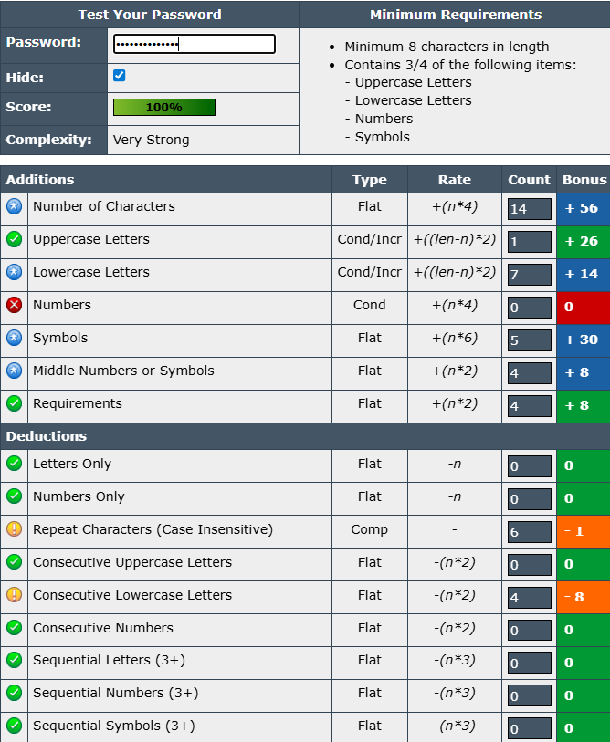
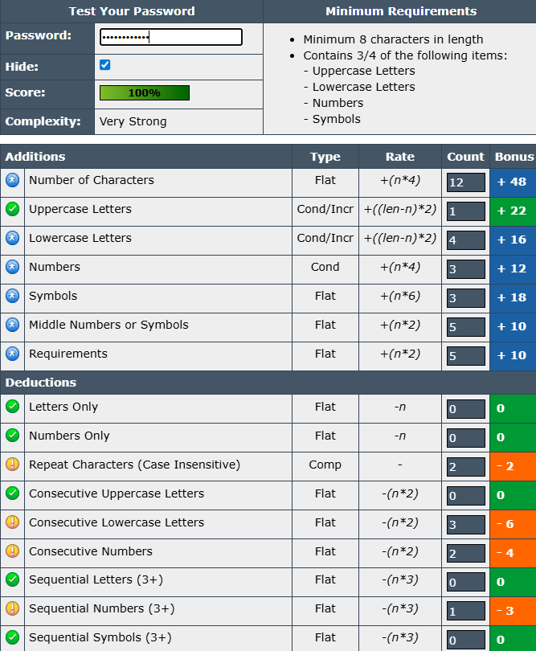

# CyberSecurity_Task_6
# Password Strength Evaluation

## Objective
To understand password security and identify best practices for creating strong passwords by testing multiple variations using a password strength checker.

---

## Steps Performed

1. **Created multiple passwords** with varying complexity:
   - Changes in length.
   - Use of uppercase, lowercase, numbers, and symbols in different combinations.
2. **Tested each password** in a password strength checker tool.
3. **Noted scores and feedback** provided by the tool (score %, complexity rating, and deductions).
4. **Compared results** to identify what makes a password strong or weak.
5. **Researched common password attacks** to understand how complexity impacts security.

---

## Test Passwords Used
*(For demonstration purposes only — these passwords are weak and should never be used in real accounts)*

1. `password` – simple lowercase word, no complexity.
2. `Password123` – capitalized word with numbers, common pattern.
3. `admin123` – common admin word with numbers, easy to guess.
4. `@dmin1234` – adds a symbol at the start, slightly better but still predictable.
5. `@dm!n_P@&&word` – long mix of words, symbols, and substitutions, much stronger.
6. `P@$$word_123` – mix of substitutions, symbols, and numbers, very strong.

---

## Password Test Results

| Password ID | Screenshot                  | Length | Uppercase | Lowercase | Numbers | Symbols | Score  | Complexity   |
|-------------|------------------------------|--------|-----------|-----------|---------|---------|--------|--------------|
| P1          |               | 8      | No        | Yes       | No      | No      | 8%     | Very Weak    |
| P2          |               | 8      | Yes       | Yes       | Yes     | No      | 75%    | Strong       |
| P3          |               | 8      | No        | Yes       | Yes     | No      | 39%    | Weak         |
| P4          |               | 9      | No        | Yes       | Yes     | Yes     | 64%    | Strong       |
| P5          |               | 10     | Yes       | Yes       | Yes     | Yes     | 100%   | Very Strong  |
| P6          |               | 12     | Yes       | Yes       | Yes     | Yes     | 100%   | Very Strong  |

---

## Key Observations

- **Length matters**: Passwords with more than 12 characters generally received higher scores.
- **Character diversity** increases strength:
  - Adding **uppercase**, **numbers**, and **symbols** significantly boosts the score.
- **Avoid consecutive characters** (e.g., `aaa` or `123`) as they reduce security.
- **No repetition**: Repeating characters deducts points.
- **Middle numbers/symbols** add extra strength versus putting them only at the end.

---

## Best Practices for Strong Passwords

1. **Use at least 12–14 characters**.
2. **Mix character types**:
   - Uppercase and lowercase letters.
   - Numbers.
   - Symbols.
3. **Avoid dictionary words** or predictable phrases.
4. **Don’t reuse passwords** across accounts.
5. **Place numbers/symbols in the middle**, not just at the start or end.
6. **Avoid sequences** (`abc123`, `qwerty`) and repeated characters.
7. **Use a password manager** to store complex passwords securely.

---

## Common Password Attacks

- **Brute Force Attack**  
  Tries all possible combinations until the correct one is found.  
  → Longer, more complex passwords take exponentially longer to crack.

- **Dictionary Attack**  
  Uses precompiled lists of common passwords/words.  
  → Avoid simple or common words.

- **Hybrid Attack**  
  Combines dictionary words with variations (e.g., `Password123!`).  
  → Avoid predictable modifications.

---

## Conclusion
Password complexity directly impacts security. Longer passwords with mixed character types and minimal patterns are significantly more resistant to brute force and dictionary attacks. Using these best practices can drastically improve account protection.
